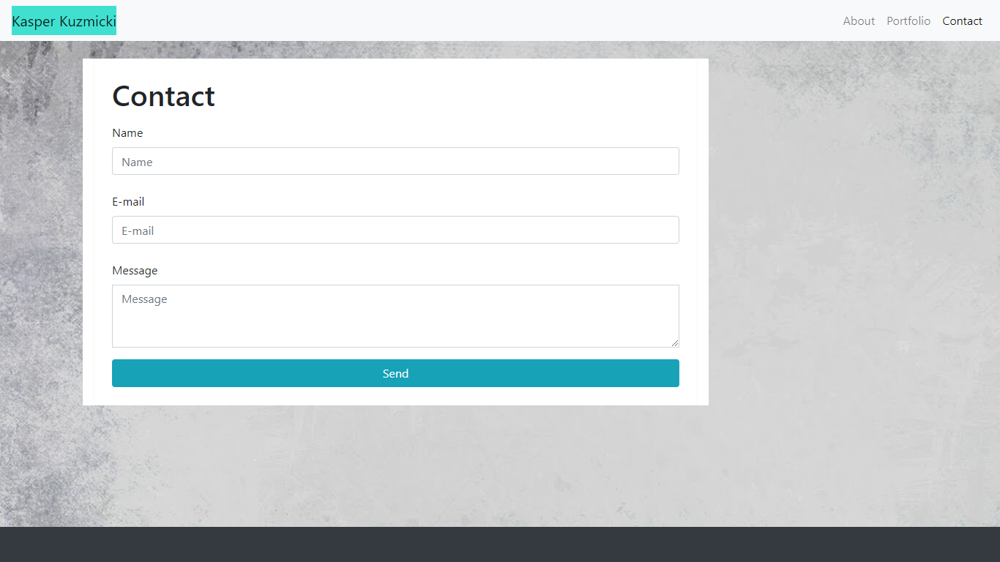

# Mobile_Responsive_Portfolio

## Description 

Welcome to my official website! It is humble but it took a surprising amount of work! The most difficult part by far was getting the footer to work properly, oddly enough. It was either too big, too small, not appearing at all etc. But I eventually got it to to work by adding a couple of things to the css pages, most notably adding the footer height of 50 pixels to the media query. 

As this was rather difficult for me and I spent a lot of time on it, I am proud of it. But it's still not perfect. My biggest disappointment was not figuring out how to have one column of pictures for the "Portfolio" page at 991 pixels width. I'm also not sure I like how the main container looks at every possible resolution for all three pages. These issues make me want to go back and fix  them at a later point.

As for functionality, there is a navbar at the top, no matter what resolution you are viewing it in. At 991 pixels width, the menu turns into a dropdown. As this web application was specifically designed with mobile viewports in mind, I paid special attention to how it looks at 400 pixels wide.

I hope you enjoy and I look forward to hearing from you soon! You can reach me at kasper.kuzmicki@yahoo.com

## Application Link

https://kwaspek104.github.io/Mobile_Responsive_Portfolio/index.html

## Image 

## Liscence 

Copyright (c) Kasper Kuzmicki. All rights reserved.
